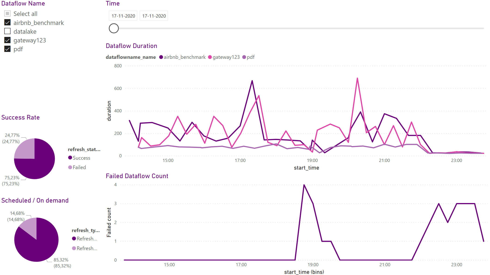

# Dataflow Monitoring Dashboard
In this step-by-step example we will show you how to set up your own monitoring dashboard for Power BI and/or Power Platform dataflows:

You can use this dashboard to monitor your Dataflows Duration and Failure count. This way you can easily track any issues with your dataflows performance and share with others.

In this example we will show 3 different exampeles on how to create your own monitoring dashboard
* Load data into CDS entity for dataflow monitoring
* Load data into an Excel file on Onedrive
* Load data directly into a Power BI Report

# Load Data into CDS entity and build Power BI report 
First, we are going to create a new table into CDS. This table will collect all the metadata from the dataflow run. For every refresh of a dataflow, we add a record to this table. We can run multiple dataflows all to the same table. When we have build the table, we can connect the .pbix file to the CDS entity.

ARCHITECTURE PICTURE

## Requirements

* Download and Install [Power BI Desktop](https://www.microsoft.com/en-us/download/details.aspx?id=58494)

* CDS environment (with rights to create new custom tables)

* Power Automate Premium Licence

* A dataflow in Power BI or Power Platform

## Clone the repository

Clone the following git repository: git clone  https://github.com/miquelladeboer/dataflowdiagnostics
to get the .pbix or/and .xlsx template(s).

## Create new table in CDS
* Navigate to https://powerapps.microsoft.com/
* Create a new Table:

* Fill in the Table name and first column name
{:class="img-responsive"}
{:height="50%" width="50%"}
{:height="700px" width="400px"}

In our example 
cc

