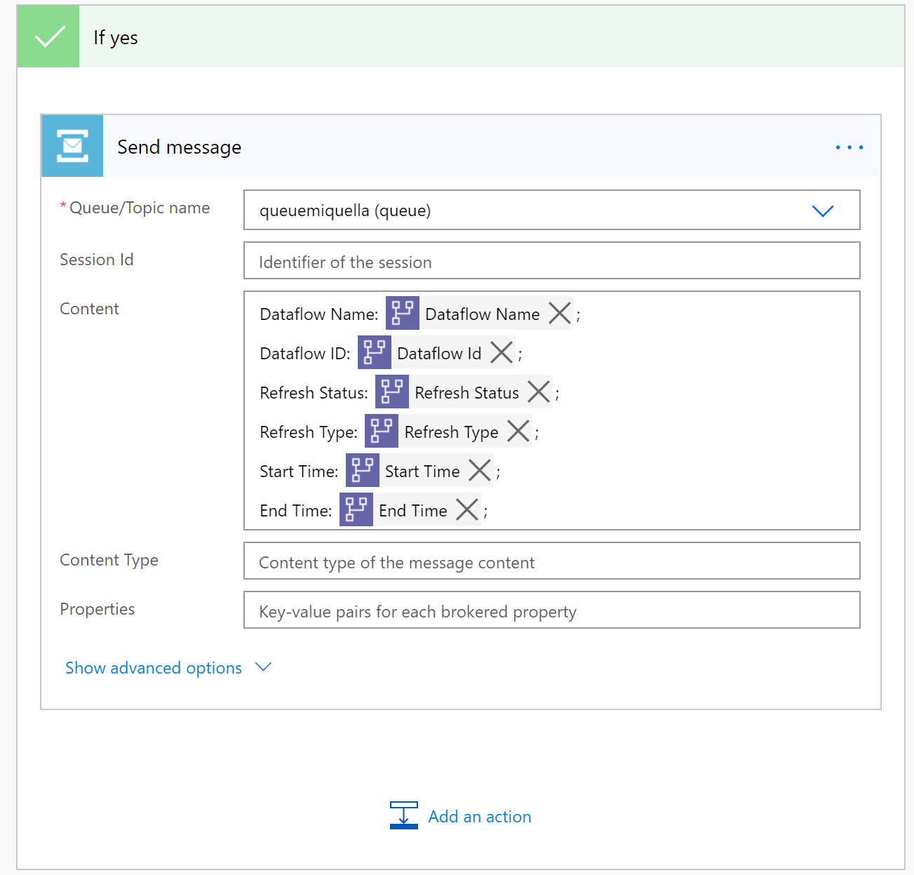

# Power Automate Dataflow Connector Templates
## Notifications
### Use Case
When your dataflow refresh completes, you want to get an email/teams or any other type of nitofication to alert you when your dataflow refresh completes. You can also set alerts based on the refresh status of the dataflow. You could for example only be notified when a dataflow refresh was completed. This way, you know your data is up to date and you can start getting new insights. Another common scenario is not get notified when a dataflow refresh failed. This way you can idediately start ivestigating the problem and alert people that depend on the data being refreshed.

### Using the templates
For sending notifications, we published three templates:
* Send an email notification when a dataflow refresh status changes
* Send email notification on success or failure of a dataflow
* When a dataflow refresh status changes, sends a Teams notification

Let's take a look at the second template:
* Navigate to flow.microsoft.com
* Search for the template **Send email notification on succes or failure of a data flow refresh**, by following these [instructions](https://docs.microsoft.com/en-us/power-automate/get-started-logic-template)

* Customize the flow
    Actions that require input from you will automatically be expanded.

   The **Dataflow Refresh** trigger is expanded because you need to enter *Dataflow*. You need to enter the following information:
   * **Group Type**: Choose *Environment* when connection to PowerApps and *Workspace* when connecting to Power BI
    * **Group**: Select the Power Apps environment or the Power BI workspace you dataflow is in
    * **Dataflow**: Select your dataflow by name

After the condition, you can specify what happens after succes or failure of the dataflow. In this template in both cases, we send you an email with the status of the dataflow refresh.

Note: you can modify the email content or flow.

## Support Tickets

### Use Cases
When your dataflow refresh completes, or has been taking longer than expected, you might want to open a support ticket/create a message in a que or service bus, so your support team can take a look at the issue.

### Using the Templates

Let's look at the template where we want to add a message to the queue, when a dataflow refresh failed. In this template, we make use of Azure Service Bus. To create an Azure Service bus an d create a Queue folllow these [instructions](https://docs.microsoft.com/en-us/azure/service-bus-messaging/service-bus-quickstart-portal#create-a-namespace-in-the-azure-portal).

* Navigate to flow.microsoft.com
* Search for the template **when a dataflow refresh failes, add a new message to the queue**, by following these [instructions](https://docs.microsoft.com/en-us/power-automate/get-started-logic-template)

* Customize the flow
    Actions that require input from you will automatically be expanded.

   The **Dataflow Refresh** trigger is expanded because you need to enter *Dataflow*. You need to enter the following information:
   * **Group Type**: Choose *Environment* when connection to PowerApps and *Workspace* when connecting to Power BI
    * **Group**: Select the Power Apps environment or the Power BI workspace you dataflow is in
    * **Dataflow**: Select your dataflow by name

After the condition, you can specify what happens after succes or failure of the dataflow. In this template in both cases, we send you an email with the status of the dataflow refresh.

Note: you can modify the message content or flow.

## Trigger Dataflows and Power BI Dataset Sequentially

### Use Cases
There are two very common use cases for how you can use this connector to trigger multiple dataflows and Power BI dataset sequentially.

1. Trigger the refresh of a Standard Dataflow after the succesfull completion of an Analytical Dataflow refresh.

If a dataflow performs all actions, then it is hard to reuse its entities in other dataflows or for other purposes. The best dataflows to reuse are those dataflows doing only a few actions. Creating dataflows that specialize in one specific task is one of the best ways of reusing them. If you have a set of dataflows as staging dataflows, their only action is to extract data "as is" from the source system. These dataflows can be reused in multiple other dataflows. For more information, take a look at the [best practices for reusing datafows](https://docs.microsoft.com/en-us/power-query/dataflows/best-practices-reusing-dataflows)

2. Trigger the refresh of a Power BI dataset when a dataflow refresh completed succesfully.

If you want to make sure that your dashboard is directly up-to-date after a dataflow refreshed your data, you can use the connector to trigger the refresh of a Power BI dataset after you dataflow refreshed succesfully.

### Using the Templates

let’s take a look at the first template:
* Navigate to flow.microsoft.com
* Search for the template **Trigger a dataflow refresh after my dataflow refresgh completed succesfully**, by following these [instructions](https://docs.microsoft.com/en-us/power-automate/get-started-logic-template)

* Customize the flow
    Actions that require input from you will automatically be expanded.

   The **Dataflow Refresh** trigger is expanded because you need to enter *Dataflow*. You need to enter the following information:
   * **Group Type**: Choose *Environment* when connection to PowerApps and *Workspace* when connecting to Power BI
    * **Group**: Select the Power Apps environment or the Power BI workspace you dataflow is in
    * **Dataflow**: Select your dataflow by name

After the condition, you can specify what happens after succes or failure of the dataflow. In this template we trigger a new datafow:

   The **refresg a dataflow** ation is expanded because you need to enter *Dataflow*. You need to enter the following information:
   * **Group Type**: Choose *Environment* when connection to PowerApps and *Workspace* when connecting to Power BI
    * **Group**: Select the Power Apps environment or the Power BI workspace you dataflow is in
    * **Dataflow**: Select your dataflow by name

[Go Back to Home Page](https://miquelladeboer.github.io/dataflowdiagnostics/)

