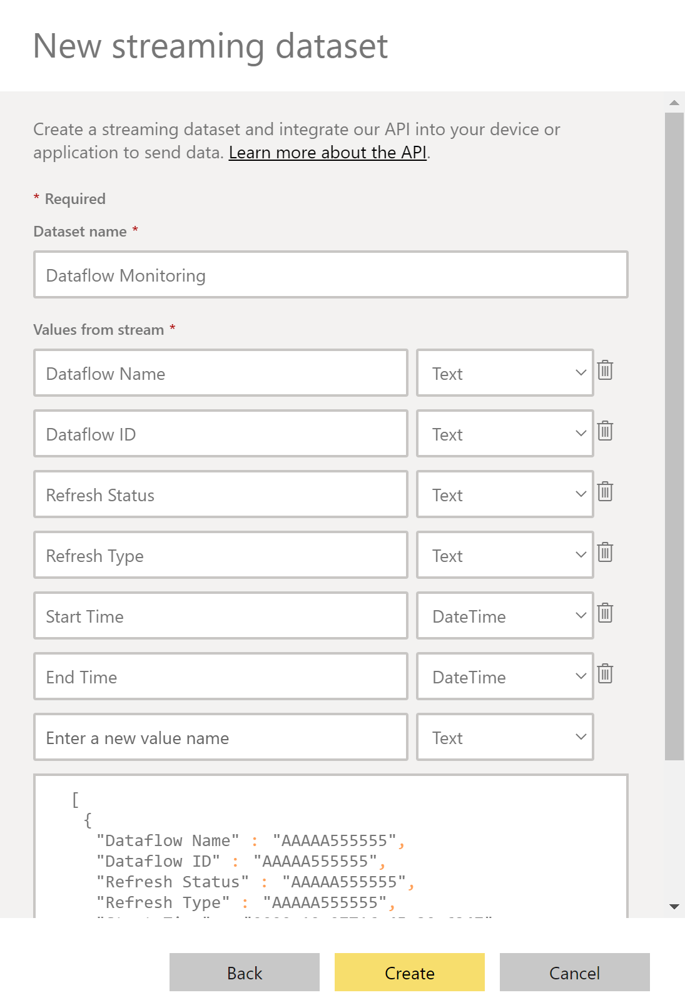
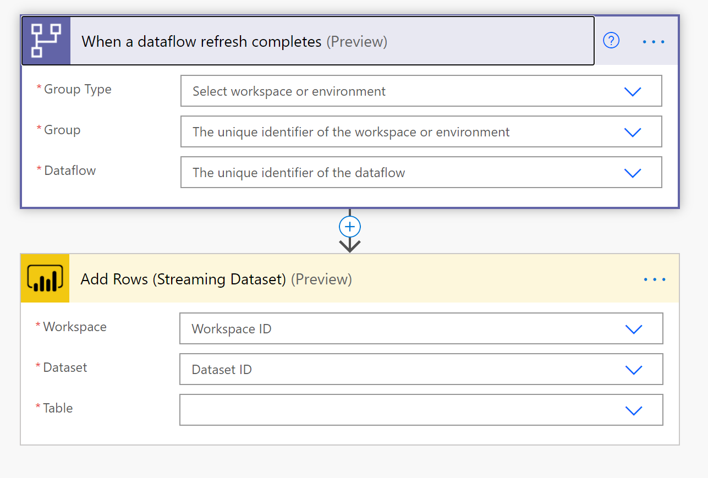
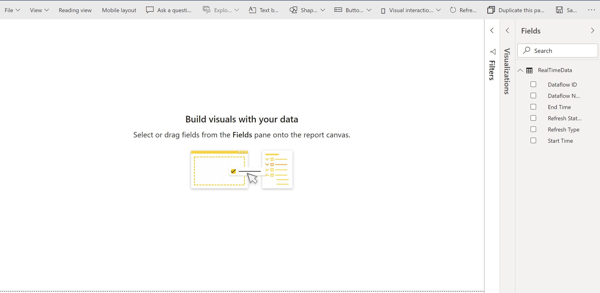

# Load Data into Power BI Streaming Dataset and build Power BI report 
In this step-by-step example we will show you how to set up your own monitoring dashboard for Power BI and/or Power Platform dataflows:

You can use this dashboard to monitor your Dataflows Duration and Failure count. This way you can easily track any issues with your dataflows performance and share with others.

First, we are going to create a new Streaming Dataset in Power BI. This dataset will collect all the metadata from the dataflow run. For every refresh of a dataflow, we add a record to this dataset. We can run multiple dataflows all to the same dataset. When we have build the data, we can build a power BI report on the data.

## Requirements

* [Power BI Pro Licence](https://docs.microsoft.com/en-us/power-bi/admin/service-admin-purchasing-power-bi-pro) 

* [Power Automate Premium Licence](https://docs.microsoft.com/en-us/power-platform/admin/pricing-billing-skus)

* A dataflow in [Power BI Dataflows](https://docs.microsoft.com/en-us/power-bi/transform-model/dataflows/dataflows-introduction-self-service) or [Power Platform Dataflows](https://docs.microsoft.com/en-us/powerapps/maker/common-data-service/create-and-use-dataflows#:~:text=Create%20a%20dataflow%201%20Sign%20in%20to%20Power,entities%20to%20be%20stored.%20...%20Mais%20itens...%20)

## Create a new streaming dataset in Power BI
* Navigate to powerbi.microsoft.com
* Follow these [Instructions](https://docs.microsoft.com/en-us/power-bi/connect-data/service-real-time-streaming#set-up-your-real-time-streaming-dataset-in-power-bi) to create a new streaming dataset in Power BI.
Note: Make sure you create a streaming dataste based on the API and add the historical data opt in.

    In the right pane, enter the following values, and then select `Create`.
    * **Dataset Name** *Dataflow Monitoring* 

    * **Value** *Dataflow Nam*, **Data type** *Text* 
    * **Value** *Dataflow DI*, **Data type** *Text* 
    * **Value** *Refresh Status*, **Data type** *Text* 
    * **Value** *Refresh Type*, **Data type** *Text*
    * **Value** *Start Time*, **Data type** *Date and Time* 
    * **Value** *End Time*, **Data type** *Date and Time*

## Create a dataflow
If you do not already have one, create a Dataflow. This can be done in either [Power BI Dataflows](https://docs.microsoft.com/en-us/power-bi/transform-model/dataflows/dataflows-introduction-self-service) or [Power Apps Dataflows](https://docs.microsoft.com/en-us/powerapps/maker/common-data-service/create-and-use-dataflows).

## Create a Power Automate Flow
* Navigate to flow.microsoft.com
* Search for the template **When a dataflows refresh completes, output status into Power BI Streaming Dataset**, by following these [instructions](https://docs.microsoft.com/en-us/power-automate/get-started-logic-template)

* Customize the flow
    Actions that require input from you will automatically be expanded.

   The **Dataflow Refresh** trigger is expanded because you need to enter *Dataflow*. You need to enter the following information:
   * **Group Type**: Choose *Environment* when connection to PowerApps and *Workspace* when connecting to Power BI
    * **Group**: Select the Power Apps environment or the Power BI workspace you dataflow is in
    * **Dataflow**: Select your dataflow by name

     The **Add Rows (Streaming Dataset)** action is expanded because you need to enter you Power BI *Workspace* and *Dataset*. You need to enter the following information:
   * **Workspace ID**: The Power Bi workspace you created your Streaming Dataset in step 1.
    * **Dataset**: Select the Streaming dataset *Dataflows Monitoring* you created in step 1
    * **Table**: The Streaming dataset we created *RealTimeData*

* Add dynamic values to the required fields

    For every required field, we are going to add a dynamic value. This value is the ouput of the meta-data of the dataflow run. 
    * click on the field  next to **Dataflow ID** and then click on the *lightning* button.
    * Add the Dataflow ID as the dynamic content

    * Repeat this proces for all required fields
  

* `Save` the flow

## Create Power BI Report
* Navigate to powerbi.microsoft.com
* Navigate to the Streaming Dataset
* Create your own report on top of this data

[Go Back to Home Page](https://miquelladeboer.github.io/dataflowdiagnostics/)

